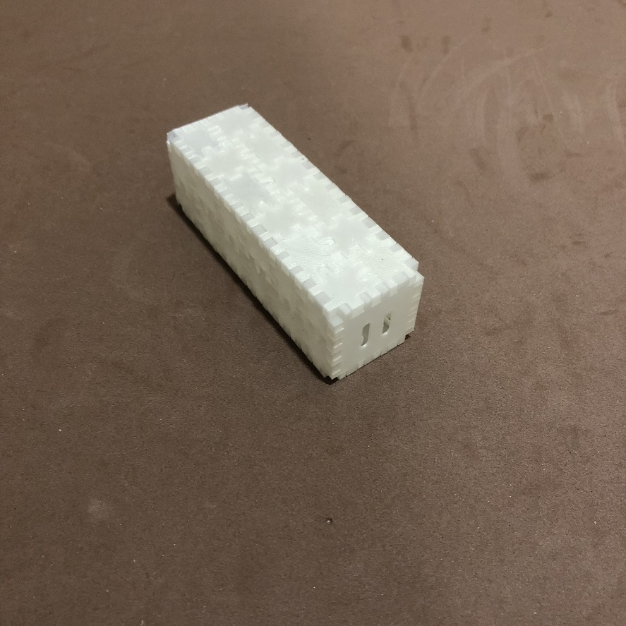
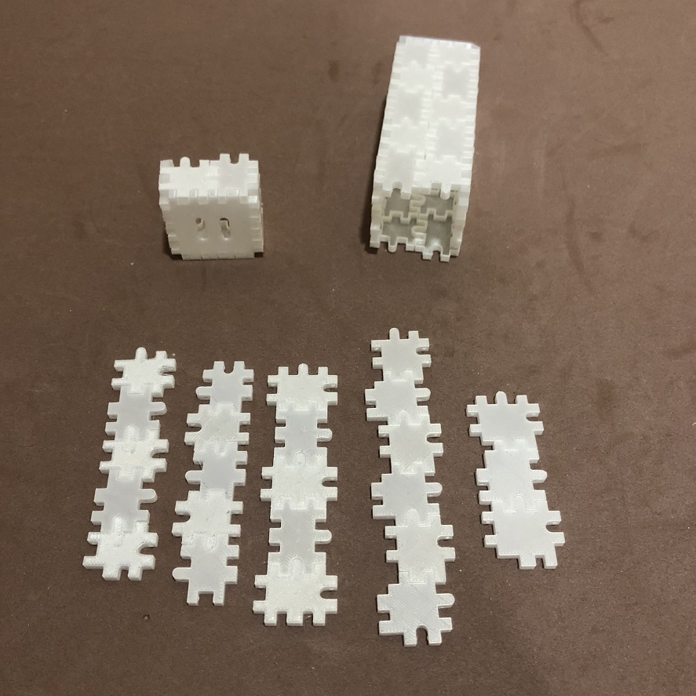
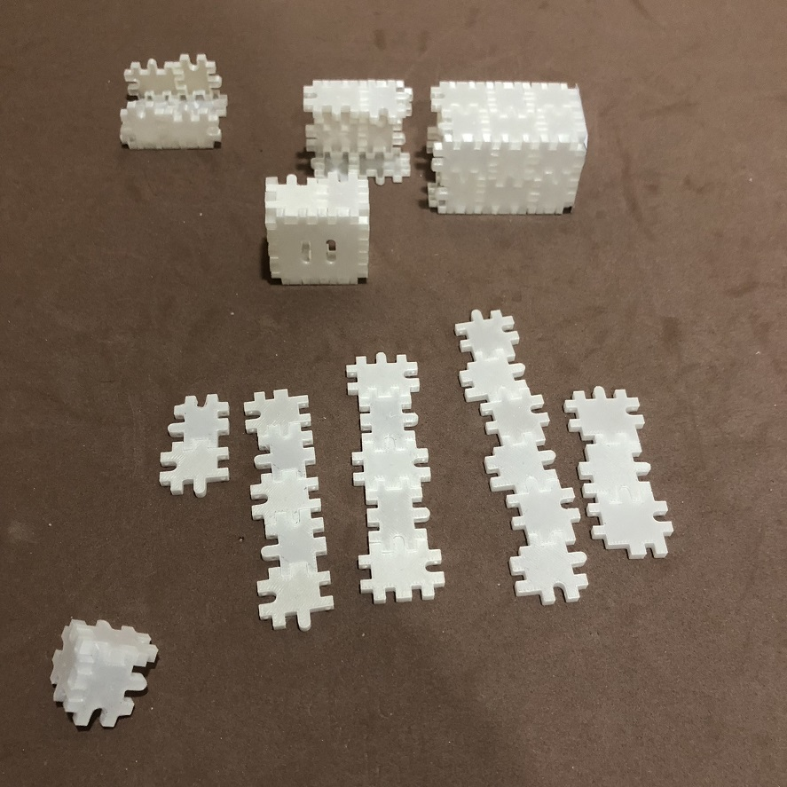
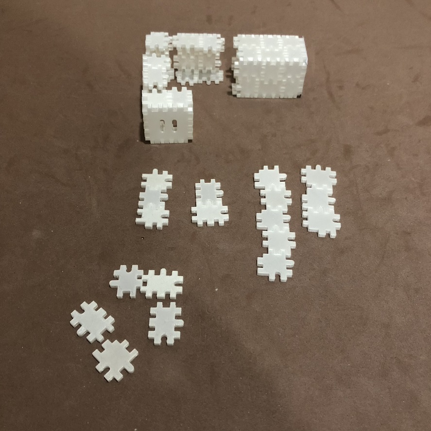
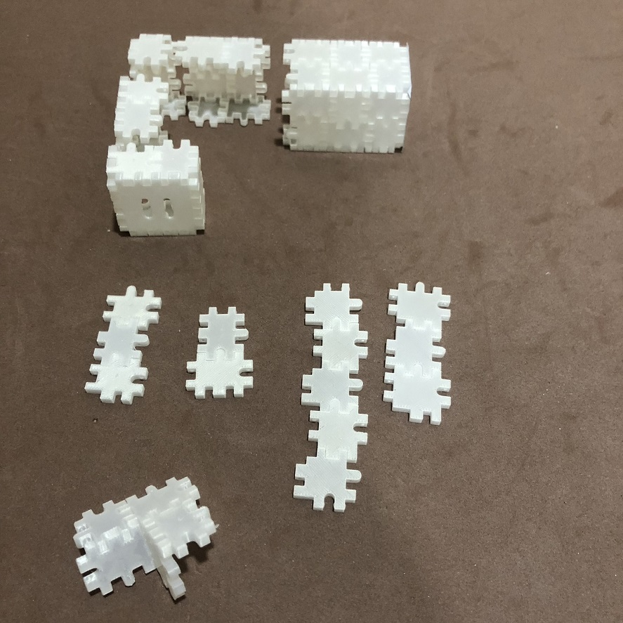
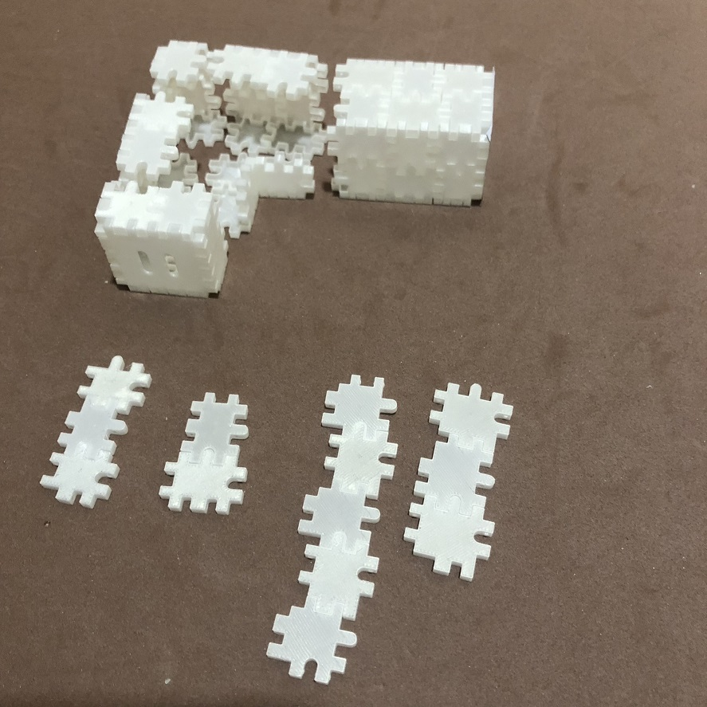
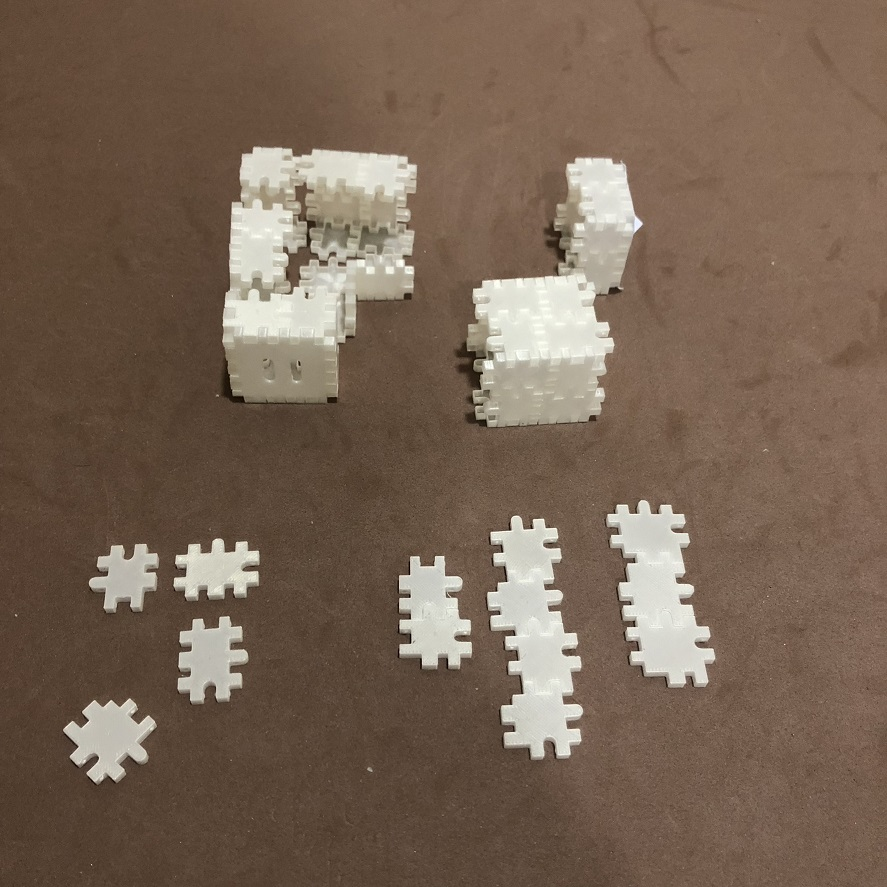
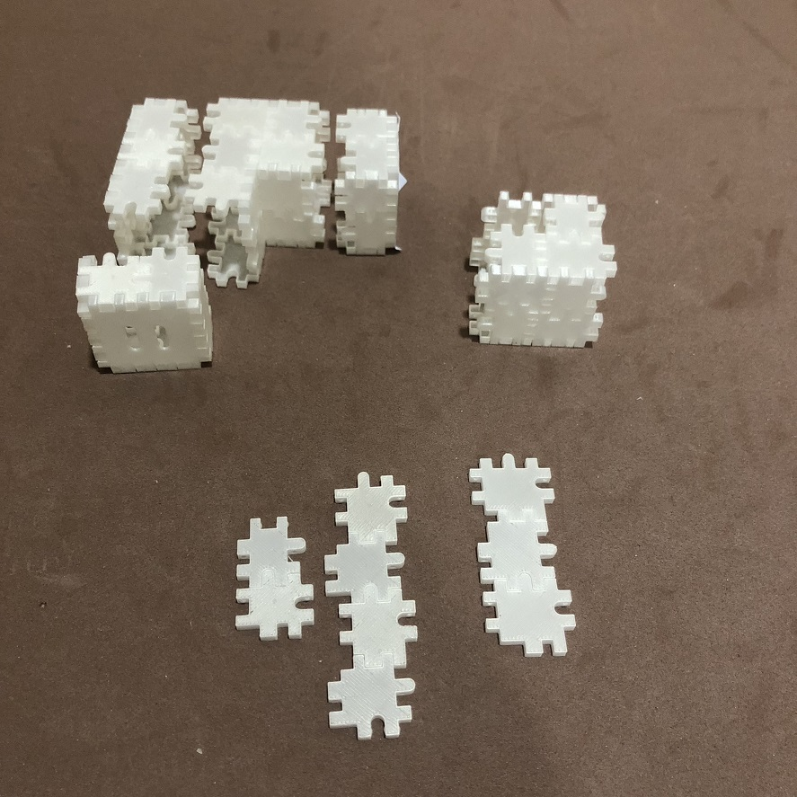
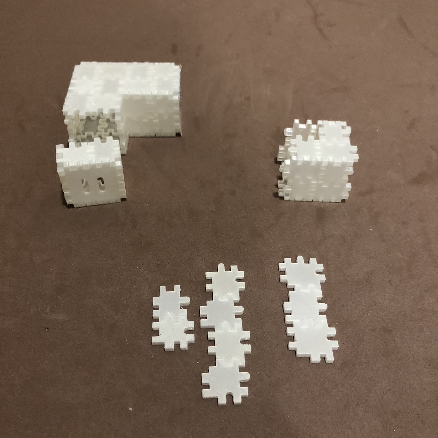

# geekcamp.sg-2022

Welcome to Geekcamp.
I will be giving a talk on the ChIPs - Polycube (Voxel) Construction Set
Track 0 at 14:15pm
If you've missed the talk or want to preview the contents, link to the slides is below.
[PDF of Talk](ChIPs-_Geekcamp.sg_2022.pdf)

Meanwhile, I cooked up a short story to entertain you.

# Hey, why did you photograph my butt? As punishment I demand you bend my body right angles to the left. I've been stuck in this straight position for far too long.

# Gently, squeeze the flat sides (not the corners) and pull to remove my head.

# Don't worry I won't die.

# Now lay out my insides as shown. From the left right, the first two columns are Panel 1s, the third column is Panel 2 and, the fourth column is panel 3, and the last column is a mix of panels 3 and 4.

# to reduce confusion, shift the panel 3 from the last column to the left.

# split my body by one segment

# and split it in half again. Position my head roughly at right angles to my main body.

# now we make up the missing parts. Take three pieces of Panel 1 (left most column) and arrange as shown. (bottom left corner)

# connect the first two pieces right angles to each other.

# and connect the third right angles to the previous two.

# now repeat and make another corner.

# join the corners together

# rearrange my parts a little and - looks halfway there already. only need to fill in the gaps.

# lay out panels 1,2 and 3 as in the bottom left corner

# join the panels together.

# and together

# and it seems fit just nice, just one more piece.

# what do you mean there's no enough pieces?!? all right you can detach another segment to take off a panel 2. We will solve the problem later.

# sigh there is now a feeling of incompleteness.

# but at least the corner bend piece is done.

# now to put everything together again.

# ah that feels good.

# the snap and crunch - just heaven

# all the fatigue seems to have gone...

# mmm...

# and the at I am whole again.

# And yes, please go look for that choonway and ask him to give you another piece of panel 2 so that you can join that segment back again. he must have somehow forgotten to put it in.
